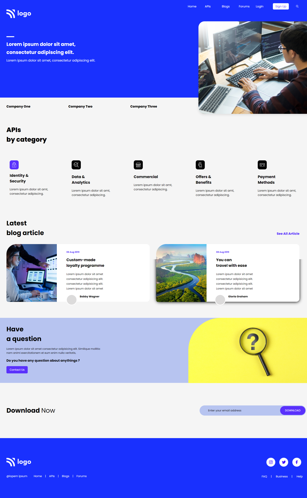

# Project 9: Developer Landing Page

   

### Name:

> `Anshul Ghogre`

## Key Learnings from the project

- _Learned About cards and in depth flexbox properties._
- _Used shadow boxes alot in this project_
- _Learned about in-depth mobile responsiveness_

---

### Screenshots:-

---

> Time taken to complete this project: 9hrs

---

## [Live-Link](https://project-9-developer-landing-page1.netlify.app/)

---
